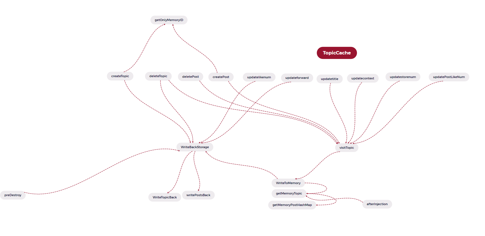

### 功能需求
**用户功能**

- 注册功能
- 登录功能
- *找回密码功能*（未实现）
- 更改用户名
- 更改密码
- 更改邮箱

**发帖功能**
- 发帖
- 更新帖子
- 回复帖子
- 查看帖子

**管理员功能**
- 删帖
- 删回复
- 拉黑用户
- 
### 计划给论坛增加缓存功能
目的为了增加论坛访问的速度
+ 增加topic队列用来缓存
+ 对于每个topic增加一个评论post的hash表，仿照hashmap
+ 开发评论点赞操作
+ 完善缓冲层，将Dao层包括在缓冲层中（可能需要重写topic,post的service的功能 ）
+ 重写后的缓存层和DAO层耦合可能有点大

### 全验证层
+ 验证参数是否合法
+ 比如验证参数是否为空，邮箱是否合法，密码是否合法

### 决定搭建TopicCache层，
+ 取代service层和Dao层的链接（完成）
+ 需要重写PostServiceImpl 和 TopicServiceImpl中的方法（完成）

# 下周任务

1. 实现完善测试缓冲层，尽量降低耦合（已完成）

2. 实现数据库连接池（待完成）

3. 实现完善全验证层（待完成）

4. 缓冲层支持多线程（待完成）

Cache层设计如下，简单在函数层面加入了多线程访问